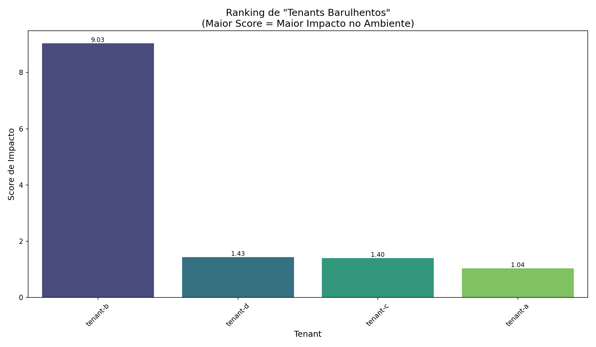

# Relatório de Análise Multi-Tenant

**Gerado em:** 2025-06-05 03:18:14

## Identificação de Tenants com Maior Impacto

**Tenant com maior impacto:** `tenant-b` (score: 9.03)

### Tabela Comparativa de Tenants

| Tenant | Score Total | Impacto Causal | Força de Correlação | Variação entre Fases |
|--------|------------|---------------|---------------------|----------------------|
| tenant-b | 9.03 | 0.25 | 0.10 | 44.39 |
| tenant-d | 1.43 | 0.20 | 0.14 | 6.45 |
| tenant-c | 1.40 | 0.38 | 0.17 | 5.81 |
| tenant-a | 1.04 | 0.30 | 0.12 | 4.25 |

*Tabela completa disponível em:* `report_20250605_031814_tenant_metrics.csv`

## Visualizações Geradas

### Análise Descritiva (5 visualizações)

- [barplot_cpu_usage_variability_round-1.png](../plots/descriptive/barplot_cpu_usage_variability_round-1.png)
- [boxplot_cpu_usage_variability_round-1.png](../plots/descriptive/boxplot_cpu_usage_variability_round-1.png)
- [timeseries_multi_cpu_usage_variability_1 - Baseline_round-1.png](../plots/descriptive/timeseries_multi_cpu_usage_variability_1 - Baseline_round-1.png)
- *...e mais 2 visualizações*

### Análise de Correlação (21 visualizações)

- [correlation_heatmap_cpu_usage_variability_1 - Baseline_round-1.png](../plots/correlation/correlation_heatmap_cpu_usage_variability_1 - Baseline_round-1.png)
- [covariance_heatmap_cpu_usage_variability_1 - Baseline_round-1.png](../plots/correlation/covariance_heatmap_cpu_usage_variability_1 - Baseline_round-1.png)
- [ccf_tenant-a_tenant-c_cpu_usage_variability_1 - Baseline_round-1.png](../plots/correlation/cross_correlation/ccf_tenant-a_tenant-c_cpu_usage_variability_1 - Baseline_round-1.png)
- *...e mais 18 visualizações*

### Análise de Causalidade (6 visualizações)

- [causality_graph_granger_cpu_usage_variability_1 - Baseline_round-1.png](../plots/causality/causality_graph_granger_cpu_usage_variability_1 - Baseline_round-1.png)
- [causality_graph_te_cpu_usage_variability_1 - Baseline_round-1.png](../plots/causality/causality_graph_te_cpu_usage_variability_1 - Baseline_round-1.png)
- [causality_graph_granger_cpu_usage_variability_2 - Attack_round-1.png](../plots/causality/causality_graph_granger_cpu_usage_variability_2 - Attack_round-1.png)
- *...e mais 3 visualizações*

### Comparação entre Fases (1 visualizações)

- [phase_comparison_cpu_usage_variability_round-1.png](../plots/phase_comparison/phase_comparison_cpu_usage_variability_round-1.png)

## Metodologia

Este relatório utiliza uma metodologia de análise multi-dimensional para identificação de tenants com maior impacto:

1. **Análise de Causalidade**:
   - Causalidade de Granger: Testa se valores passados de um tenant ajudam a prever valores futuros de outro.
   - Transfer Entropy: Quantifica a transferência de informação direcional entre séries temporais.

2. **Análise de Correlação**:
   - Mede a força da relação linear entre métricas de diferentes tenants.
   - Valores mais altos indicam maior interdependência.

3. **Variação entre Fases**:
   - Quantifica a magnitude da alteração nas métricas durante fases de ataque vs. baseline.
   - Tenants com maior variação são mais sensíveis ao ambiente.

**O score final é calculado como média ponderada:**
- 50% Impacto Causal (maior peso para causalidade detectada via Transfer Entropy)
- 30% Força de Correlação
- 20% Variação entre Fases

### Limitações da Metodologia

- A causalidade estatística não implica necessariamente causalidade física direta.
- Correlação não implica causalidade; pode refletir fatores externos comuns.
- A análise presume séries temporais adequadamente amostradas e estacionárias.
