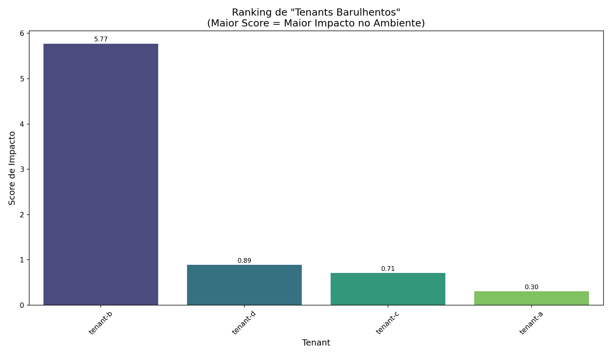

# Relatório de Análise Multi-Tenant

**Gerado em:** 2025-06-03 16:47:54

## Identificação de Tenants com Maior Impacto

**Tenant com maior impacto:** `tenant-b` (score: 5.77)

### Tabela Comparativa de Tenants

| Tenant | Score Total | Impacto Causal | Força de Correlação | Variação entre Fases |
|--------|------------|---------------|---------------------|----------------------|
| tenant-b | 5.77 | 0.40 | 0.13 | 27.65 |
| tenant-d | 0.89 | 0.47 | 0.14 | 3.06 |
| tenant-c | 0.71 | 0.43 | 0.15 | 2.24 |
| tenant-a | 0.30 | 0.42 | 0.14 | 0.26 |

*Tabela completa disponível em:* `report_20250603_164754_tenant_metrics.csv`

## Visualizações Geradas

### Análise Descritiva (20 visualizações)

- [barplot_cpu_usage_round-1.png](../plots/descriptive/barplot_cpu_usage_round-1.png)
- [boxplot_cpu_usage_round-1.png](../plots/descriptive/boxplot_cpu_usage_round-1.png)
- [timeseries_multi_cpu_usage_1 - Baseline_round-1.png](../plots/descriptive/timeseries_multi_cpu_usage_1 - Baseline_round-1.png)
- *...e mais 17 visualizações*

### Análise de Correlação (24 visualizações)

- [correlation_heatmap_cpu_usage_1 - Baseline_round-1_pearson.png](../plots/correlation/correlation_heatmap_cpu_usage_1 - Baseline_round-1_pearson.png)
- [covariance_heatmap_cpu_usage_1 - Baseline_round-1.png](../plots/correlation/covariance_heatmap_cpu_usage_1 - Baseline_round-1.png)
- [correlation_heatmap_cpu_usage_2 - Attack_round-1_pearson.png](../plots/correlation/correlation_heatmap_cpu_usage_2 - Attack_round-1_pearson.png)
- *...e mais 21 visualizações*

### Análise de Causalidade (12 visualizações)

- [causality_graph_granger_cpu_usage_1 - Baseline_round-1.png](../plots/causality/causality_graph_granger_cpu_usage_1 - Baseline_round-1.png)
- [causality_graph_te_cpu_usage_1 - Baseline_round-1.png](../plots/causality/causality_graph_te_cpu_usage_1 - Baseline_round-1.png)
- [causality_graph_granger_cpu_usage_2 - Attack_round-1.png](../plots/causality/causality_graph_granger_cpu_usage_2 - Attack_round-1.png)
- *...e mais 9 visualizações*

### Comparação entre Fases (4 visualizações)

- [phase_comparison_cpu_usage_round-1.png](../plots/phase_comparison/phase_comparison_cpu_usage_round-1.png)
- [phase_comparison_memory_usage_round-1.png](../plots/phase_comparison/phase_comparison_memory_usage_round-1.png)
- [phase_comparison_cpu_usage_round-1.png](../plots/phase_comparison/phase_comparison_cpu_usage_round-1.png)
- *...e mais 1 visualizações*

## Metodologia

Este relatório utiliza uma metodologia de análise multi-dimensional para identificação de tenants com maior impacto:

1. **Análise de Causalidade**:
   - Causalidade de Granger: Testa se valores passados de um tenant ajudam a prever valores futuros de outro.
   - Transfer Entropy: Quantifica a transferência de informação direcional entre séries temporais.

2. **Análise de Correlação**:
   - Mede a força da relação linear entre métricas de diferentes tenants.
   - Valores mais altos indicam maior interdependência.

3. **Variação entre Fases**:
   - Quantifica a magnitude da alteração nas métricas durante fases de ataque vs. baseline.
   - Tenants com maior variação são mais sensíveis ao ambiente.

**O score final é calculado como média ponderada:**
- 50% Impacto Causal (maior peso para causalidade detectada via Transfer Entropy)
- 30% Força de Correlação
- 20% Variação entre Fases

### Limitações da Metodologia

- A causalidade estatística não implica necessariamente causalidade física direta.
- Correlação não implica causalidade; pode refletir fatores externos comuns.
- A análise presume séries temporais adequadamente amostradas e estacionárias.
