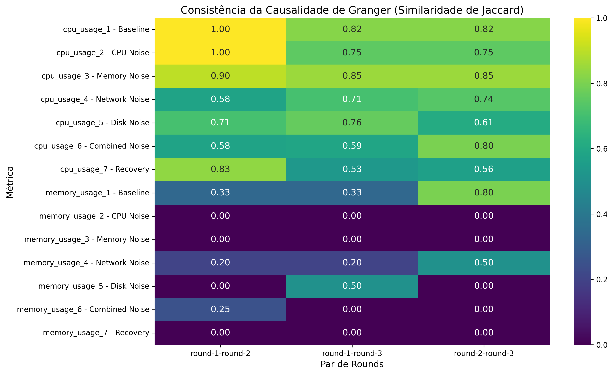
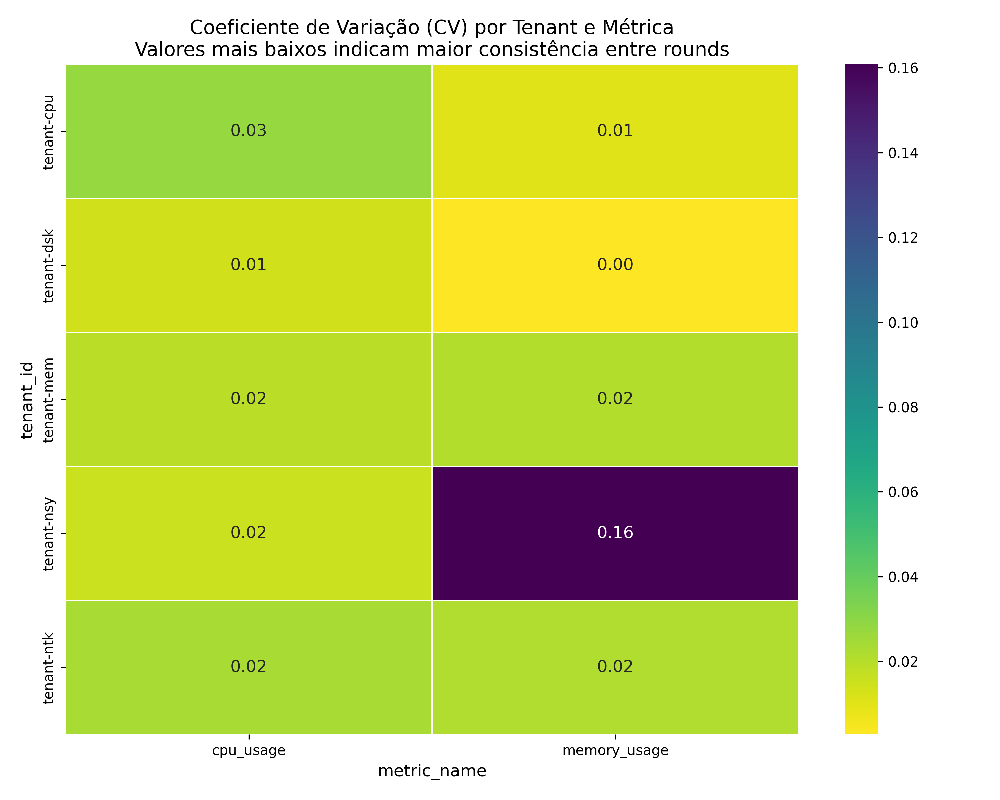
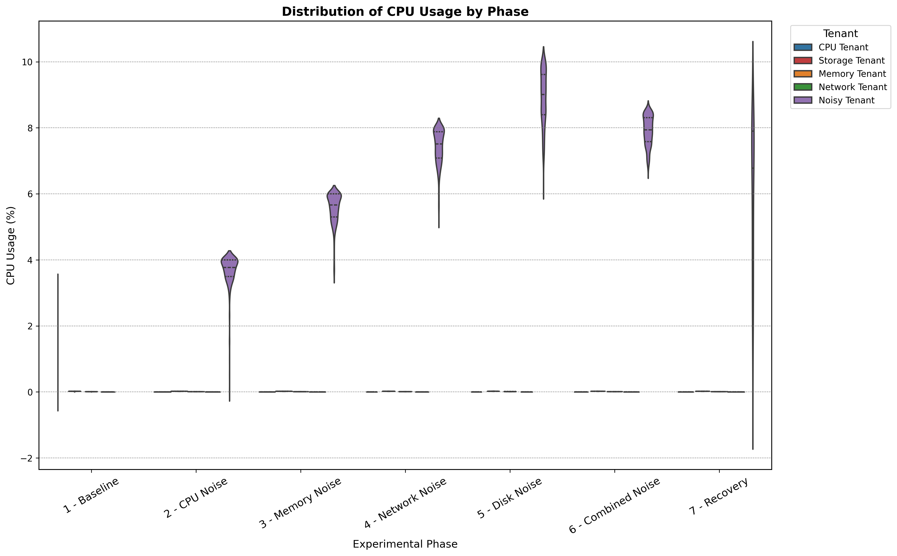
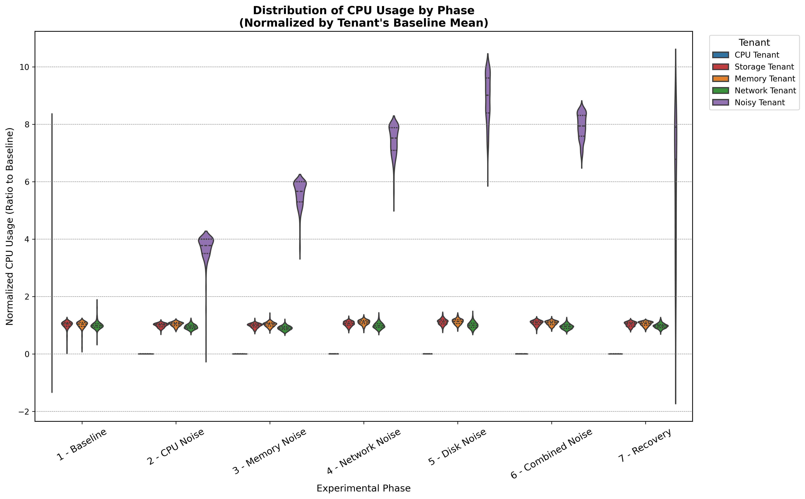
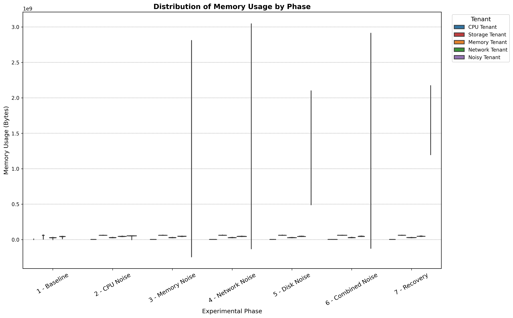
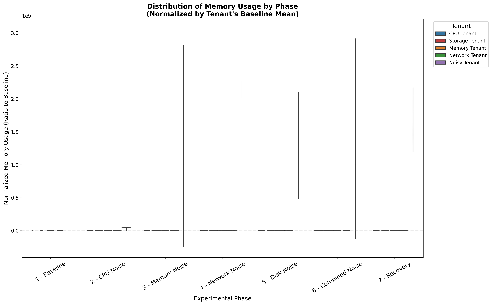

# Relatório Consolidado de Análise Multi-Round

Relatório gerado em: 2025-06-30 14:48:34

Este relatório apresenta uma análise compreensiva de múltiplos rounds de um experimento, avaliando a consistência, robustez e divergências comportamentais para fornecer um veredito consolidado sobre os resultados.

## 1. Consistência da Estrutura Causal

Avalia a consistência das relações causais identificadas entre os rounds.

### 1.1. Causalidade de Granger (Similaridade de Jaccard)
A tabela a seguir mostra a similaridade de Jaccard entre os conjuntos de relações causais (p < 0.05) para cada par de rounds. Valores mais próximos de 1 indicam maior consistência na ESTRUTURA do grafo causal.

| Metric                          |   round-1-round-2 |   round-1-round-3 |   round-2-round-3 |
|:--------------------------------|------------------:|------------------:|------------------:|
| cpu_usage_1 - Baseline          |          1        |          0.818182 |          0.818182 |
| cpu_usage_2 - CPU Noise         |          1        |          0.75     |          0.75     |
| cpu_usage_3 - Memory Noise      |          0.9      |          0.85     |          0.85     |
| cpu_usage_4 - Network Noise     |          0.578947 |          0.705882 |          0.736842 |
| cpu_usage_5 - Disk Noise        |          0.705882 |          0.764706 |          0.611111 |
| cpu_usage_6 - Combined Noise    |          0.578947 |          0.588235 |          0.8      |
| cpu_usage_7 - Recovery          |          0.833333 |          0.533333 |          0.5625   |
| memory_usage_1 - Baseline       |          0.333333 |          0.333333 |          0.8      |
| memory_usage_2 - CPU Noise      |          0        |          0        |          0        |
| memory_usage_3 - Memory Noise   |          0        |          0        |          0        |
| memory_usage_4 - Network Noise  |          0.2      |          0.2      |          0.5      |
| memory_usage_5 - Disk Noise     |          0        |          0.5      |          0        |
| memory_usage_6 - Combined Noise |          0.25     |          0        |          0        |
| memory_usage_7 - Recovery       |          0        |          0        |          0        |

## 2. Robustez das Relações Causais

Análise de robustez causal não foi executada ou não produziu resultados.

## 3. Consistência dos Valores de Métricas

Análise da estabilidade dos valores das métricas através dos rounds, utilizando o Coeficiente de Variação (CV). Baixo CV indica alta consistência.

Para dados detalhados, veja `round_consistency_cv.csv`.

## 4. Análise de Divergência Comportamental

Identifica rounds com comportamento anômalo e mede a estabilidade do comportamento dos tenants através dos rounds usando a Divergência de Kullback-Leibniz.

Para dados detalhados, veja `tenant_stability_scores.csv`.

## 4.1. Boxplots Consolidados (Violin Plots)

**🆕 Visualizações aprimoradas** que mostram a distribuição de cada métrica por fase experimental, agregando dados de todos os rounds. Os violin plots oferecem uma visão mais rica da densidade dos dados em comparação com os boxplots tradicionais.

### Boxplots por Métrica
Para cada métrica, são gerados dois gráficos:
- **Valores Brutos**: Mostra a distribuição real dos dados.
- **Valores Normalizados**: Normaliza os dados pela média da fase 'Baseline' de cada tenant, permitindo uma comparação justa do *impacto relativo* das fases de stress.

#### Cpu Usage

#### Memory Usage

## 4.2. Time Series Consolidados

**Visualizações avançadas** que agregam a evolução temporal de todas as métricas através dos rounds, facilitando a identificação de padrões, tendências e divergências comportamentais.

### Time Series por Métrica
Cada visualização inclui:
- **Evolução por Round**: Tendências agregadas entre todos os tenants
- **Evolução por Tenant**: Comportamento individual de cada tenant em todos os rounds
- **Tendências Suavizadas**: Médias móveis para identificar padrões de longo prazo
- **Distribuições por Fase**: Boxplots comparando fases experimentais

#### Cpu Usage

#### Memory Usage

**Interpretação**: 
- **Convergência entre rounds** indica comportamento reproduzível
- **Divergências significativas** podem indicar efeitos de noisy neighbors
- **Padrões temporais consistentes** sugerem relações causais estáveis

## 4.3. Gráficos de Correlação Agregada

Estes grafos mostram as correlações médias entre os tenants, agregadas através de todos os rounds e fases. As arestas representam a força da correlação (positiva ou negativa) entre os pares de tenants.

Gráficos de correlação agregada não foram gerados nesta execução.

## 5. Veredictos de Consenso

Análise de consenso não foi executada ou não produziu resultados.

## Sumário Final

A análise multi-round fornece insights sobre a estabilidade e reprodutibilidade dos resultados do experimento. Alta consistência sugere que as relações causais e comportamentos observados são robustos. Baixa consistência pode indicar que o sistema exibe comportamento variável ou que os resultados são sensíveis a condições iniciais, necessitando de investigação adicional.
