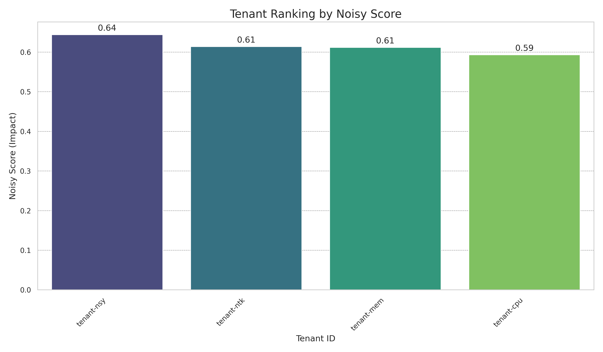
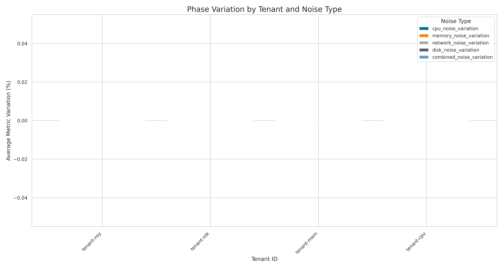

# Multi-Tenant Analysis Report

**Generated on:** 2025-06-21 22:14:41

## Identification of Tenants with the Greatest Impact

**Tenant with the greatest impact:** `tenant-nsy` (score: 0.64)

### Tenant Comparative Table

| Tenant | Total Score | Causal Impact | Correlation | Total Variation | CPU Var. | Memory Var. | Network Var. | Disk Var. | Combined Var. |
|---|---|---|---|---|---|---|---|---|---|
| tenant-nsy | 0.64 | 1.20 | 0.15 | 0.00 | 0.00 | 0.00 | 0.00 | 0.00 | 0.00 |
| tenant-ntk | 0.61 | 1.11 | 0.20 | 0.00 | 0.00 | 0.00 | 0.00 | 0.00 | 0.00 |
| tenant-mem | 0.61 | 1.11 | 0.18 | 0.00 | 0.00 | 0.00 | 0.00 | 0.00 | 0.00 |
| tenant-cpu | 0.59 | 1.10 | 0.14 | 0.00 | 0.00 | 0.00 | 0.00 | 0.00 | 0.00 |

*Full table available at:* `report_20250621_221441_tenant_metrics.csv`

## Generated Visualizations

### Phase Variation Analysis

### Descriptive Analysis (20 visualizations)

- [barplot_memory_usage_round-1.png](../plots/descriptive/barplot_memory_usage_round-1.png)
- [boxplot_memory_usage_round-1.png](../plots/descriptive/boxplot_memory_usage_round-1.png)
- [timeseries_multi_memory_usage_allphases_round-1.png](../plots/descriptive/timeseries_multi_memory_usage_allphases_round-1.png)
- *...and 17 more visualizations*

### Correlation Analysis (106 visualizations)

- [correlation_heatmap_memory_usage_1 - Baseline_round-1.png](../plots/correlation/correlation_heatmap_memory_usage_1 - Baseline_round-1.png)
- [covariance_heatmap_memory_usage_1 - Baseline_round-1.png](../plots/correlation/covariance_heatmap_memory_usage_1 - Baseline_round-1.png)
- [ccf_tenant-cpu_tenant-mem_memory_usage_1 - Baseline_round-1.png](../plots/correlation/cross_correlation/ccf_tenant-cpu_tenant-mem_memory_usage_1 - Baseline_round-1.png)
- *...and 103 more visualizations*

### Causality Analysis (20 visualizations)

- [causality_graph_granger_memory_usage_2 - CPU Noise_round-1.png](../plots/causality/causality_graph_granger_memory_usage_2 - CPU Noise_round-1.png)
- [causality_graph_te_memory_usage_2 - CPU Noise_round-1.png](../plots/causality/causality_graph_te_memory_usage_2 - CPU Noise_round-1.png)
- [causality_graph_granger_memory_usage_3 - Memory Noise_round-1.png](../plots/causality/causality_graph_granger_memory_usage_3 - Memory Noise_round-1.png)
- *...and 17 more visualizations*

## Methodology

This report uses a multi-dimensional analysis methodology to identify tenants with the greatest impact:

1. **Causality Analysis**:
   - Granger Causality: Tests whether past values of one tenant help predict future values of another.
   - Transfer Entropy: Quantifies the directional information transfer between time series.

2. **Correlation Analysis**:
   - Measures the strength of the linear relationship between metrics of different tenants.
   - Higher values indicate greater interdependence.

3. **Phase Variation**:
   - Quantifies the magnitude of change in metrics during various noise phases (CPU, Memory, etc.) compared to the baseline.
   - Tenants with higher variation are considered to have a greater impact or be more sensitive to the noisy environment.

**The final score is calculated as a weighted average:**
- 50% Causal Impact (with higher weight for causality detected via Transfer Entropy)
- 30% Correlation Strength
- 20% Phase Variation

### Limitations of the Methodology

- Statistical causality does not necessarily imply direct physical causality.
- Correlation does not imply causation; it may reflect common external factors.
- The analysis assumes that the time series are adequately sampled and stationary.
