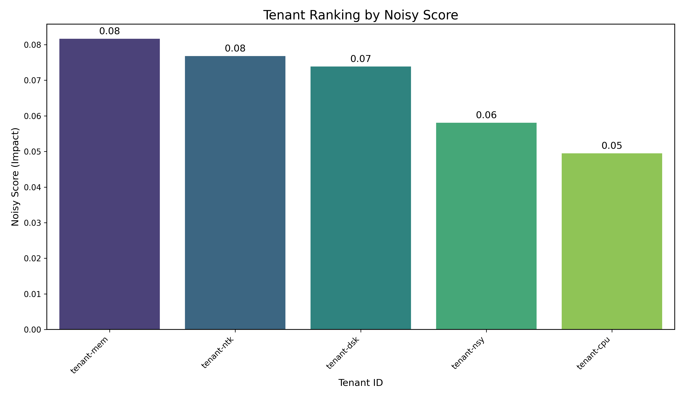
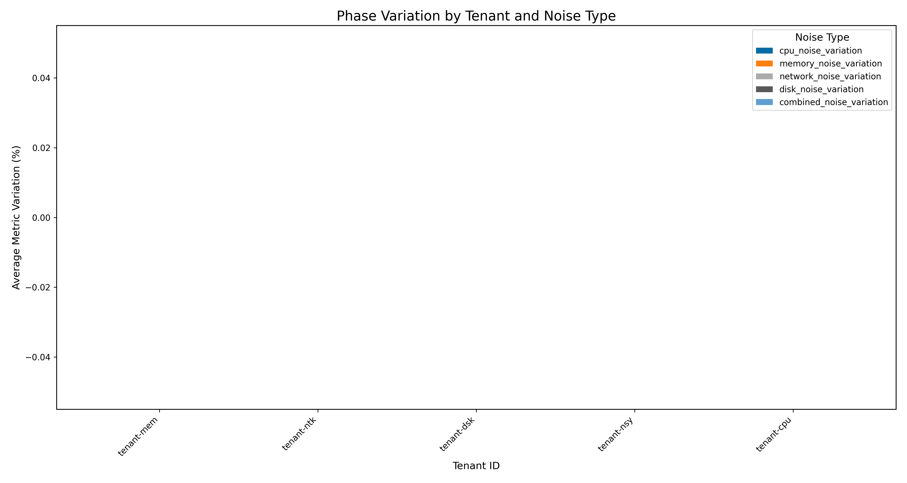

# Multi-Tenant Analysis Report

**Generated on:** 2025-06-30 11:52:52

## Identification of Tenants with the Greatest Impact

**Tenant with the greatest impact:** `tenant-mem` (score: 0.08)

### Tenant Comparative Table

| Tenant | Total Score | Causal Impact | Correlation | Total Variation | CPU Var. | Memory Var. | Network Var. | Disk Var. | Combined Var. |
|---|---|---|---|---|---|---|---|---|---|
| tenant-mem | 0.08 | 0.00 | 0.27 | 0.00 | 0.00 | 0.00 | 0.00 | 0.00 | 0.00 |
| tenant-ntk | 0.08 | 0.00 | 0.26 | 0.00 | 0.00 | 0.00 | 0.00 | 0.00 | 0.00 |
| tenant-dsk | 0.07 | 0.00 | 0.25 | 0.00 | 0.00 | 0.00 | 0.00 | 0.00 | 0.00 |
| tenant-nsy | 0.06 | 0.00 | 0.19 | 0.00 | 0.00 | 0.00 | 0.00 | 0.00 | 0.00 |
| tenant-cpu | 0.05 | 0.00 | 0.16 | 0.00 | 0.00 | 0.00 | 0.00 | 0.00 | 0.00 |

*Full table available at:* `report_20250630_115252_tenant_metrics.csv`

## Generated Visualizations

### Phase Variation Analysis

### Descriptive Analysis (60 visualizations)

- [barplot_cpu_usage_round-1.png](../plots/descriptive/barplot_cpu_usage_round-1.png)
- [boxplot_cpu_usage_round-1.png](../plots/descriptive/boxplot_cpu_usage_round-1.png)
- [timeseries_all_phases_cpu_usage_round-1.png](../plots/descriptive/timeseries_all_phases_cpu_usage_round-1.png)
- *...and 57 more visualizations*

### Correlation Analysis (438 visualizations)

- [covariance_heatmap_cpu_usage_1 - Baseline_round-1.png](../plots/correlation/covariance_heatmap_cpu_usage_1 - Baseline_round-1.png)
- [ccf_tenant-cpu_tenant-dsk_cpu_usage_1 - Baseline_round-1.png](../plots/correlation/cross_correlation/ccf_tenant-cpu_tenant-dsk_cpu_usage_1 - Baseline_round-1.png)
- [ccf_tenant-cpu_tenant-mem_cpu_usage_1 - Baseline_round-1.png](../plots/correlation/cross_correlation/ccf_tenant-cpu_tenant-mem_cpu_usage_1 - Baseline_round-1.png)
- *...and 435 more visualizations*

## Methodology

This report uses a multi-dimensional analysis methodology to identify tenants with the greatest impact:

1. **Causality Analysis**:
   - Granger Causality: Tests whether past values of one tenant help predict future values of another.
   - Transfer Entropy: Quantifies the directional information transfer between time series.

2. **Correlation Analysis**:
   - Measures the strength of the linear relationship between metrics of different tenants.
   - Higher values indicate greater interdependence.

3. **Phase Variation**:
   - Quantifies the magnitude of change in metrics during various noise phases (CPU, Memory, etc.) compared to the baseline.
   - Tenants with higher variation are considered to have a greater impact or be more sensitive to the noisy environment.

**The final score is calculated as a weighted average:**
- 50% Causal Impact (with higher weight for causality detected via Transfer Entropy)
- 30% Correlation Strength
- 20% Phase Variation

### Limitations of the Methodology

- Statistical causality does not necessarily imply direct physical causality.
- Correlation does not imply causation; it may reflect common external factors.
- The analysis assumes that the time series are adequately sampled and stationary.
